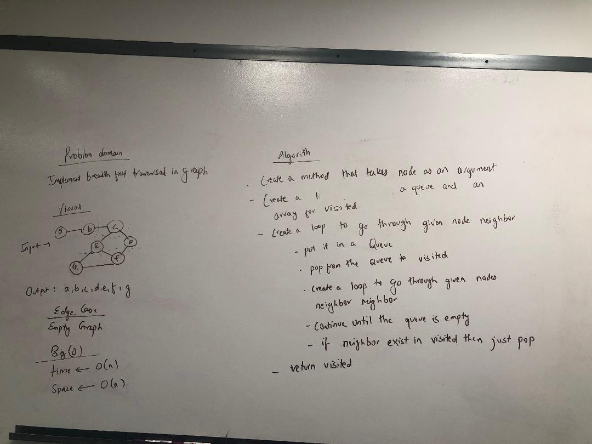

# Challenge Summary
Implement a breadth-first traversal on a graph.

## Challenge Description
Extend your graph object with a breadth-first traversal method that accepts a starting node. Without utilizing any of the built-in methods, return a collection of nodes in the order they were visited. Display the collection.

## Approach & Efficiency
Started with a whiteboard and used it as a reference to complete the code.

## Solution
  

## [Link to the code](../src/main/java/BreadthFirst/BreadthFirst.java)

