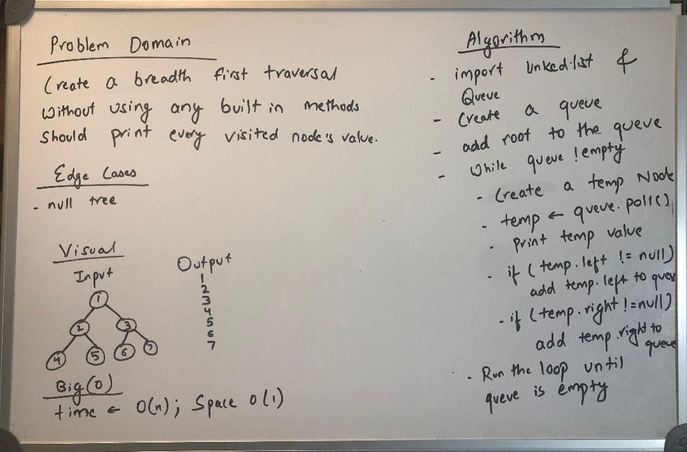

# Challenge Summary - Class 17
Create a Breadth-first Traversal

## Challenge Description
A breadthFirst traversal method was created which takes a Binary Tree as its unique input. Without utilizing any of the built-in methods, the input tree was traversed using a Breadth-first approach and every visited node’s value was printed

## Approach & Efficiency
Started with a whiteboard and used it as a reference to complete the code.

## Solution
  

## [Link to the code](../src/main/java/Tree/BreadthFirstClass.java)
