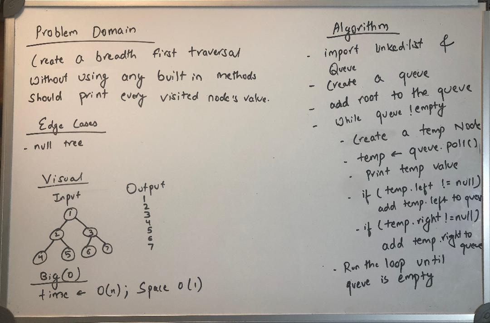

# Challenge Summary - Class 17
Find the Maximum Value in a Binary Tree

## Challenge Description
A function called findMaximumValue was created which takes binary tree as its only input and return maximum value.

## Approach & Efficiency
Started with a whiteboard and used it as a reference to complete the code.

## Solution
  

## [Link to the code](../src/main/java/Tree/FindMaximum.java)
