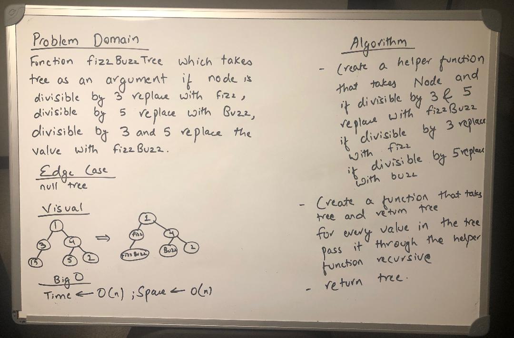

# Challenge Summary
Conduct “FizzBuzz” on a tree while traversing through it.

## Challenge Description
A breadthFirst traversal method was created which takes a Binary Tree as its unique input. Without utilizing any of the built-in methods available to your language, traverse the input tree using a Breadth-first approach and print every visited node’s value.

## Approach & Efficiency
Started with a whiteboard and used it as a reference to complete the code.

## Solution
  

## [Link to the code](../src/main/java/FizzBuzzTree/FizzBuzzTree.java)
