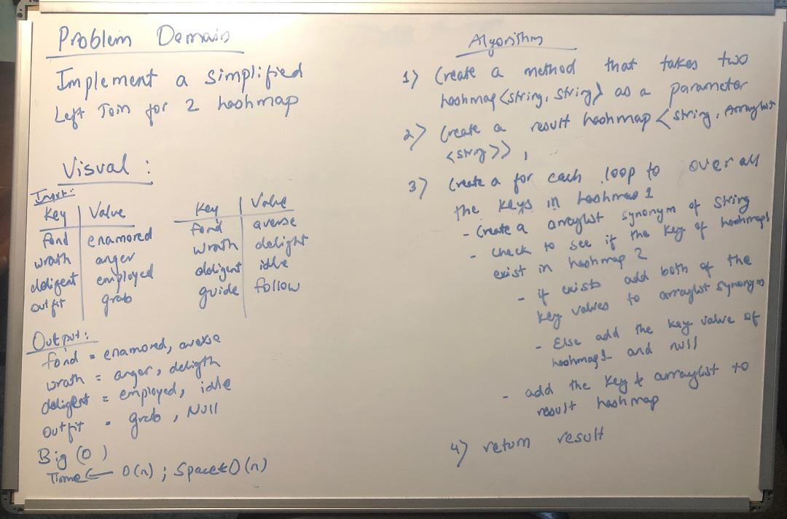

# Challenge Summary
Implement a simplified LEFT JOIN for 2 Hashmaps.

## Challenge Description
1. A function that LEFT JOINs two hashmaps into a single data structure.
2. The first parameter is a hashmap that has word strings as keys, and a synonym of the key as values.
3. The second parameter is a hashmap that has word strings as keys, and antonyms of the key as values.
4. Combine the key and corresponding values (if they exist) into a new data structure according to LEFT JOIN logic.
LEFT JOIN means all the values in the first hashmap are returned, and if values exist in the “right” hashmap, they are appended to the result row. If no values exist in the right hashmap, then some flavor of NULL should be appended to the result row.
5. Avoid utilizing any of the library methods available to your language.

## Approach & Efficiency
Started with a whiteboard and used it as a reference to complete the code.

## Solution
  

## [Link to the code](../src/main/java/LeftJoin/LeftJoin.java)

