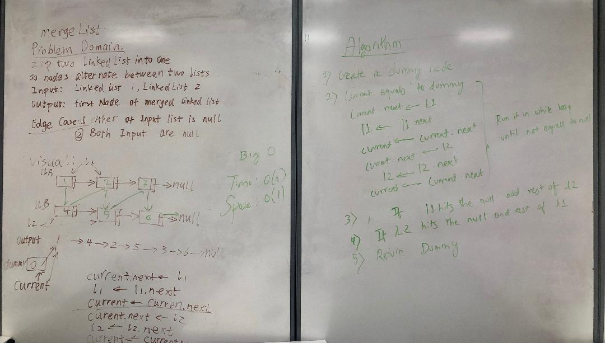

# Challenge Summary
Writing a method for merge a Linked List into another Linked List at Alternate Positions..

## Challenge Description
1. A function called mergeLists which takes two linked lists as arguments. Zip the two linked lists together into one so that the nodes alternate between the two lists and return a reference to the head of the zipped list.    

## Approach & Efficiency
Started with a whiteboard and used it as a reference to complete the code.

## Solution
  

## [Link to the code](https://github.com/kushshrestha01/data-structures-and-algorithms/blob/master/401-code-challenges/src/main/java/linkedList/LinkedList.java)

