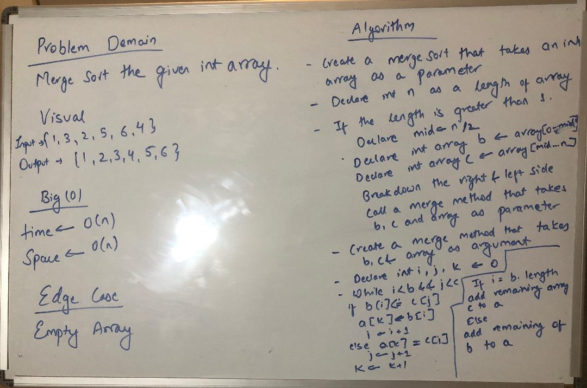

# Code Challenge/Lab 26: Implement InsertionSort
Creating a lecture for the students.

## Challenge Description
The Lecture notes was written with the given Pseudo Code

## Approach & Efficiency
Used the Pseudo code to write the code

## Solution
  

## [Lecture](lecture.md)
