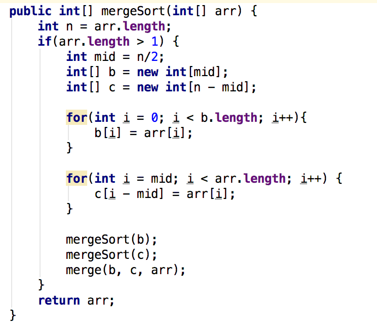

# Merge Sort Algorithm
Merge sort Algorithm to sort the given int array.

## Learning Objectives
To learn the use of mergeSort method that sorts the given int array

## Lecture Flow
Arrays are used to store multiple values in a single variable, instead of declaring separate variables for each value.  
Sorting is important in programming as it makes it  easier and faster to locate items when it is sorted.  
The time complexity for the worst, average and best is O(nLogn) since it will always divide the array into two and then merge.
The space complexity is O(n) as we’re creating temporary arrays in every recursive call.
   
### Another main point
If the data are sorted it is easier to analyse duplicate entities.  
If the data are sorted it is easier to compare two arrays.  
If the data are sorted it is easier to find any int in that array.  

## Algorithm
Merge Sort is divide and conquer method. Merge Sort uses the recurssive method that divides input array in two halves, calls itself for the two halves. and then merges the two sorted halves.

## Pseudocode
  
  

## Readings and References
## Watch Video
[Video](https://www.youtube.com/watch?v=TzeBrDU-JaY)

## Read
[Article 1](https://www.geeksforgeeks.org/merge-sort/)

[Article 2](https://howtodoinjava.com/algorithm/merge-sort-java-example/)

[Article 3](https://algs4.cs.princeton.edu/22mergesort/)

## [Code](/Users/kusshres/codefellows/401/data-structures-and-algorithms/401-code-challenges/src/main/java/mergeSort/MergeSort.java)
## [Code Test](/Users/kusshres/codefellows/401/data-structures-and-algorithms/401-code-challenges/src/test/java/mergeSort/MergeSortTest.java)
