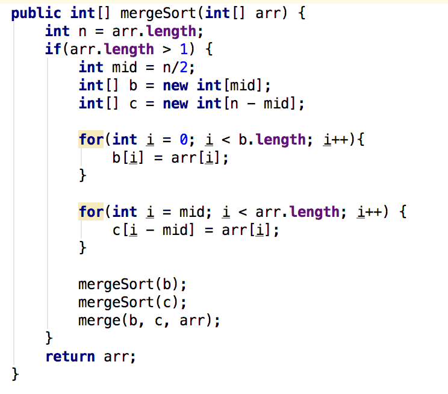
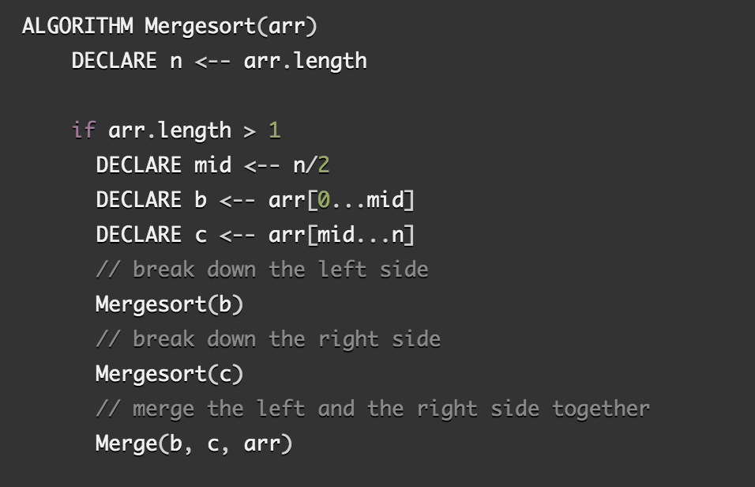
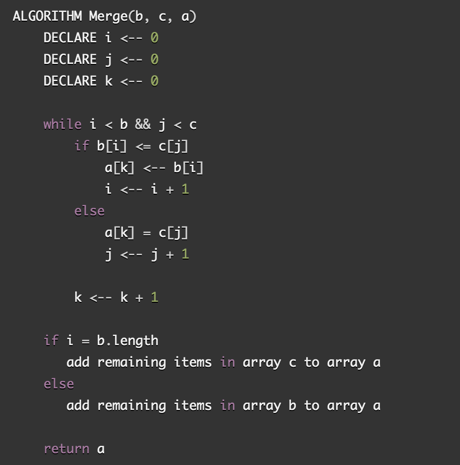

# Quick Sort Algorithm
Quick Sort Algorithm to sort the given int array.

## Learning Objectives
To learn the use of quickSort method that sorts the given int array

## Lecture Flow
Arrays are used to store multiple values in a single variable, instead of declaring separate variables for each value.  
Sorting is important in programming as it makes it  easier and faster to locate items when it is sorted.  
When implemented well, it can be about two or three times faster than its main competitors, merge sort and heapsort.
   
### Another main point
If the data are sorted it is easier to analyse duplicate entities.  
If the data are sorted it is easier to compare two arrays.  
If the data are sorted it is easier to find any int in that array.  

## Algorithm
Merge Sort is divide and conquer method. Merge Sort uses the recurssive method that divides input array in two halves, calls itself for the two halves. and then merges the two sorted halves.

## Pseudocode
  
  

## Readings and References
## Watch Video
[Video](https://www.youtube.com/watch?v=COk73cpQbFQ)

## Read
[Article 1](https://www.geeksforgeeks.org/quick-sort/)

[Article 2](https://www.hackerearth.com/practice/algorithms/sorting/quick-sort/tutorial/)

