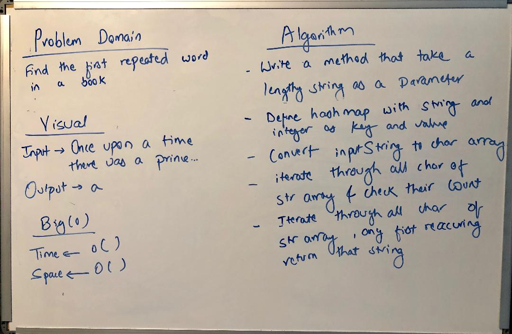

# Challenge Summary
Find the first repeated word in a book.

## Challenge Description
1. Writing a function that accepts a lengthy string parameter.
2. Without utilizing any built-in library methods available, returning the first word to occur more than once in that provided string.

## Approach & Efficiency
Started with a whiteboard and used it as a reference to complete the code.

## Solution
  

## [Link to the code](../src/main/java/RepeatedWord/RepeatedWord.java)

