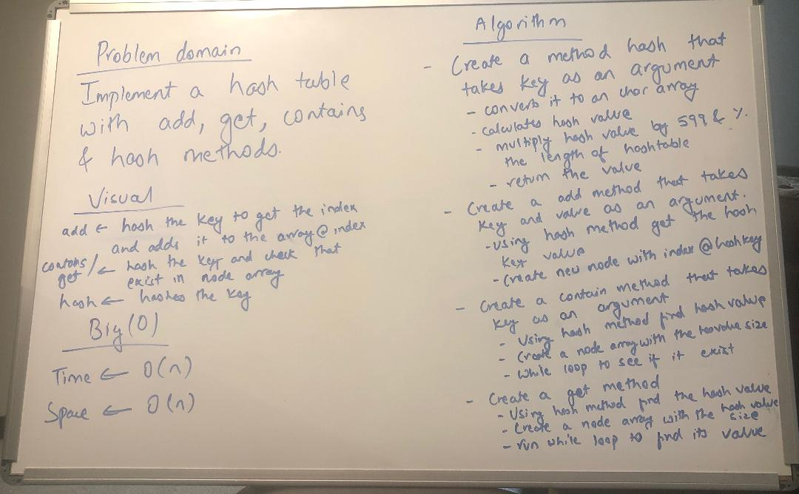

# Challenge Summary
Find common values in 2 binary trees.

## Challenge Description
1. A method called tree_intersection that takes two binary tree parameters was created.
2. Without utilizing any of the built-in library methods, a set of values found in both trees were returned.

## Approach & Efficiency
Started with a whiteboard and used it as a reference to complete the code.

## Solution
  

## [Link to the code](../src/main/java/TreeIntersection/TreeIntersection.java)

