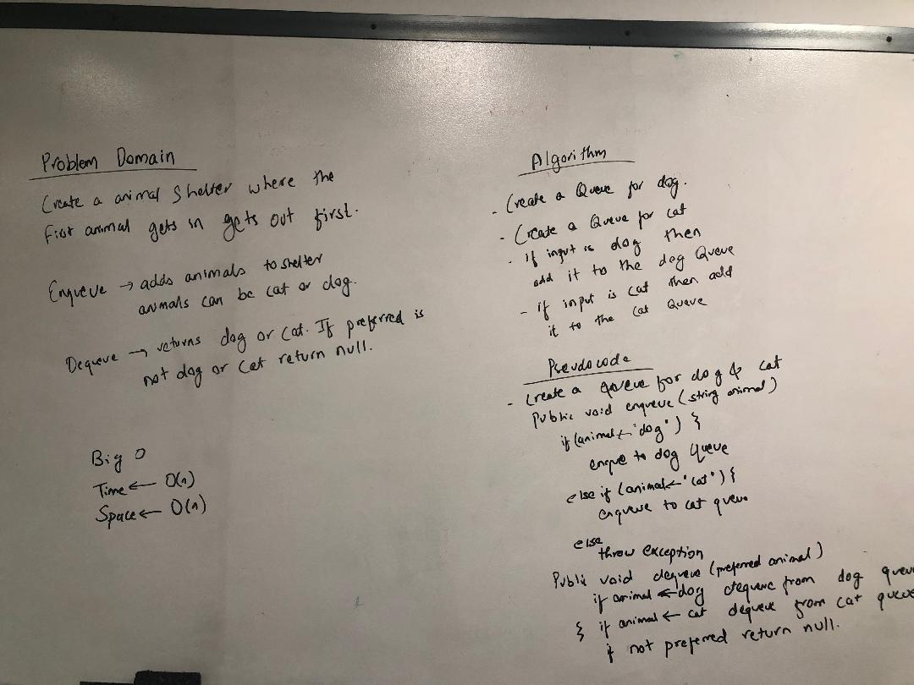

# Challenge Summary
Creating a First-in, First out Animal Shelter.

## Challenge Description
1. Created a class called AnimalShelter which holds only dogs and cats. The shelter operates using a first-in, first-out approach.
2. Implemented enqueue method that adds animal to the shelter. animal can be either a dog or a cat object.
2. Implemented dequeue method that returns either a dog or a cat. If pref is not "dog" or "cat" then return null.

## Approach & Efficiency
Started with a whiteboard and used it as a reference to complete the code.

## Solution
  

## [Link to the code](https://github.com/kushshrestha01/data-structures-and-algorithms/blob/master/401-code-challenges/src/main/java/fifoAnimalShelter/AnimalShelter.java)

